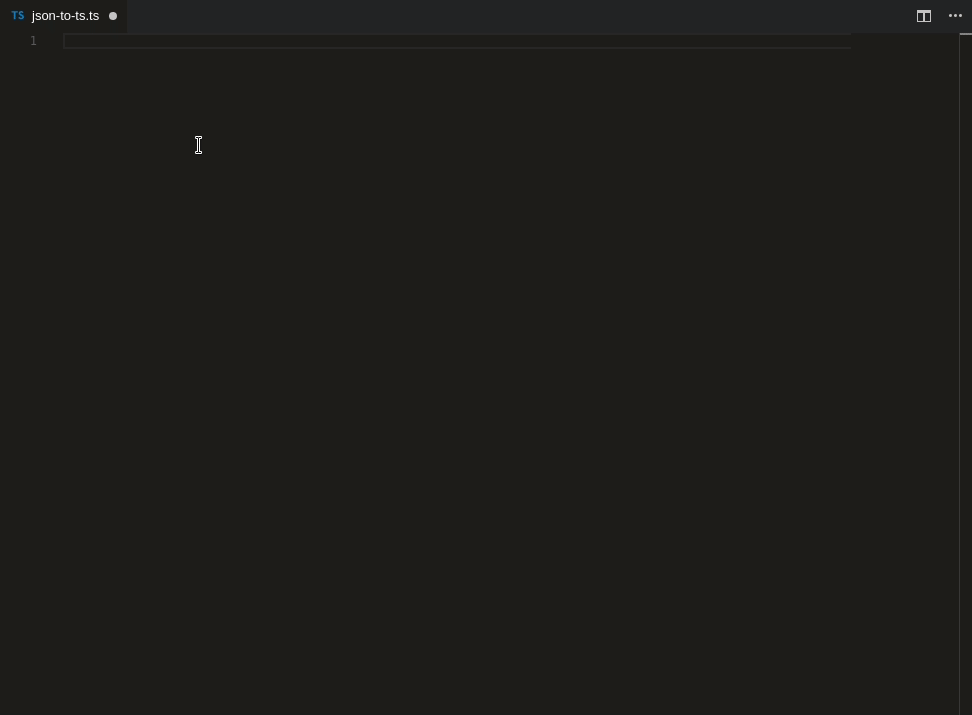
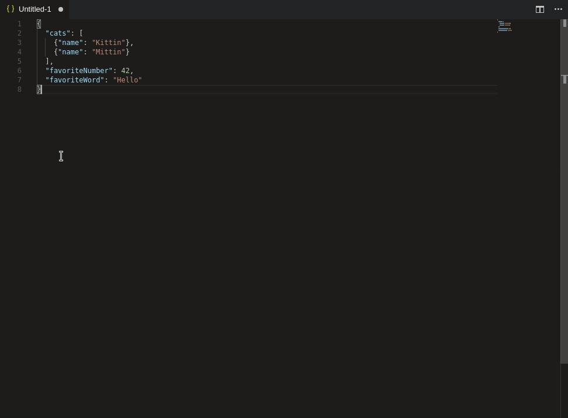
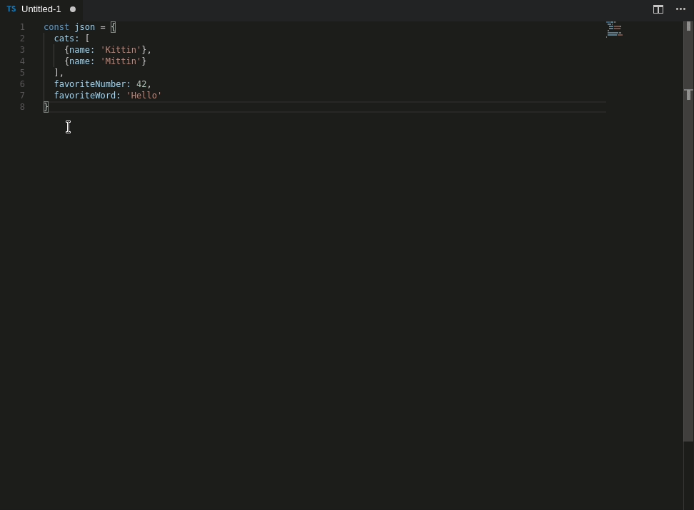

# RAW to TS

### Convert JSON object to typescript interfaces

## Features

#### Convert from clipboard (`Shift + Ctrl + Alt + V`)

#### Convert from selection (`Shift + Ctrl + Alt + S`)

#### Optional quotes

## Converter

- Array type merging (**Huge deal**)
- Duplicate type prevention
- Union types
- Optional types
- Array types

## Known Issues

`Command failed: xclip -selection clipboard -o`

---

Solution: `sudo apt-get install xclip`

Happens when linux is missing clipboard packages

## Links

- [Repo](https://github.com/guqingming/vscode-raw-to-ts)
